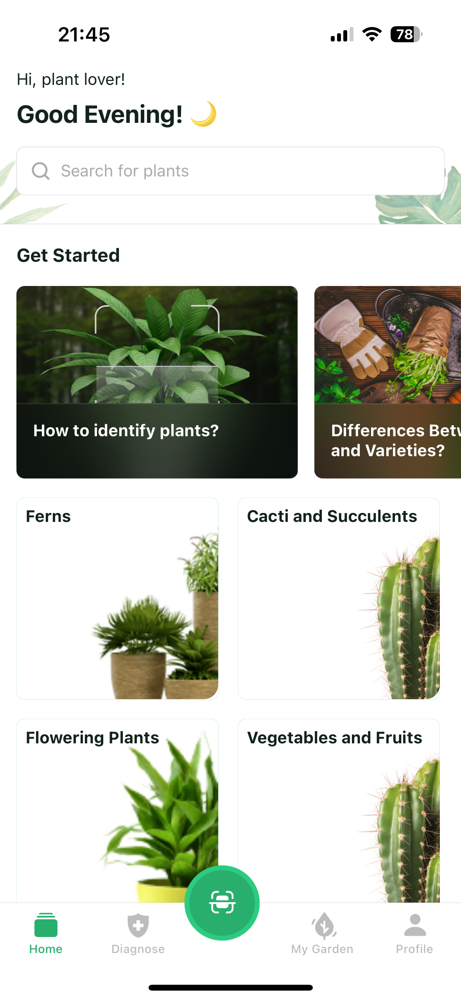

# Plant App 🌱

A simple mobile app to browse and search for plants.

## Screenshots 📸



## Tech Stack 🧑🏻‍💻

- **React Native**: Framework for building native apps using React.
- **Expo**: Toolset for developing, building, and deploying React Native apps.
- **Expo Router**: For implementing app navigation.
- **Redux**: State management solution.
- **NativeWind**: Styling solution for React Native.

## Installation 🛠️

1. Clone the repository
   ```bash
   git clone https://github.com/ekaynak94/plant-app.git
   ```
2. Install dependencies

   ```bash
    cd plant-app
    npm install
   ```

3. Run the app
   ```bash
    npm start
   ```

Enjoy!
